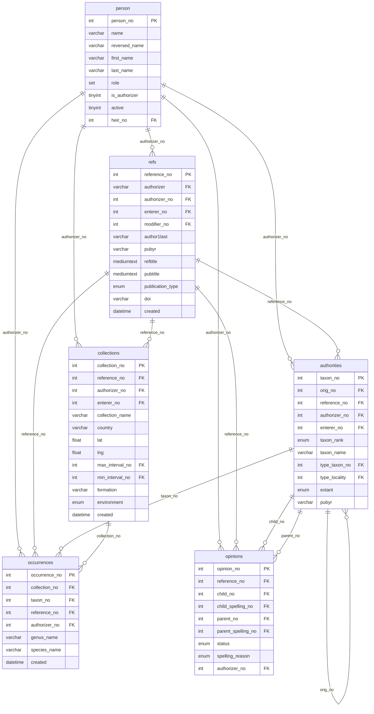
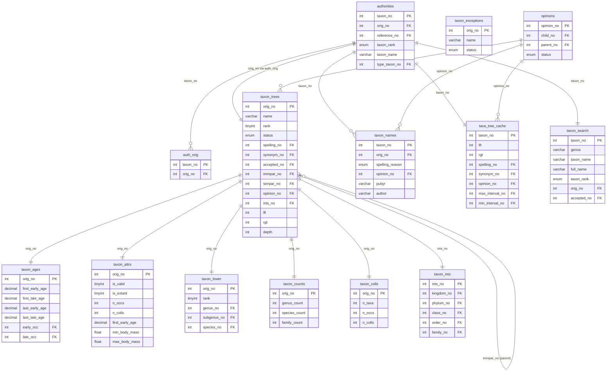
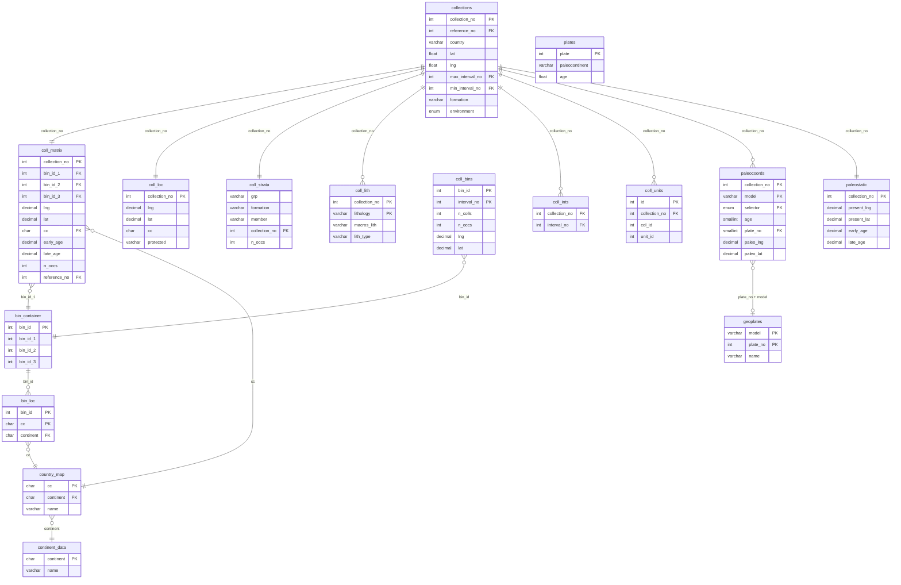
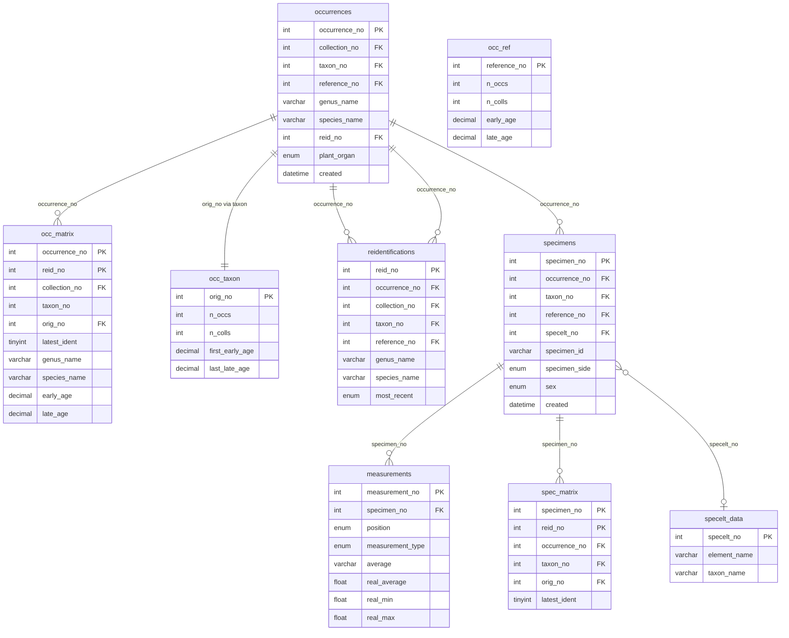
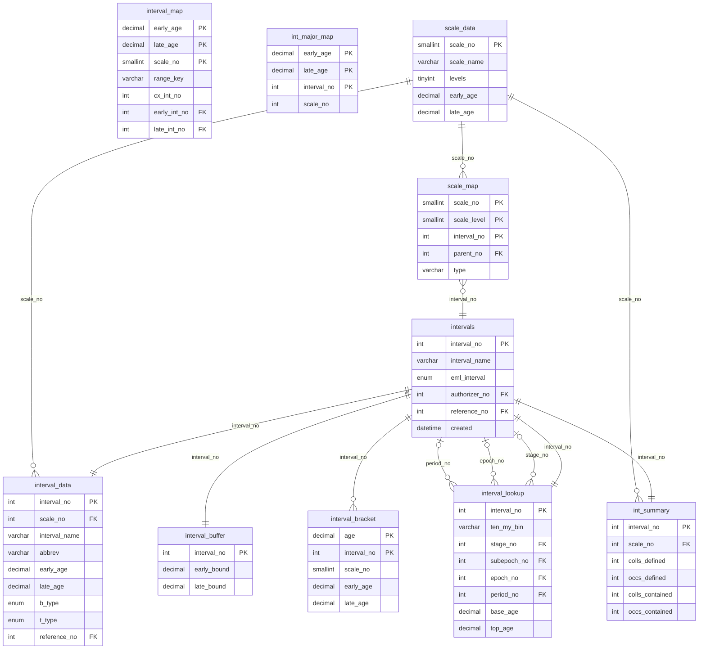
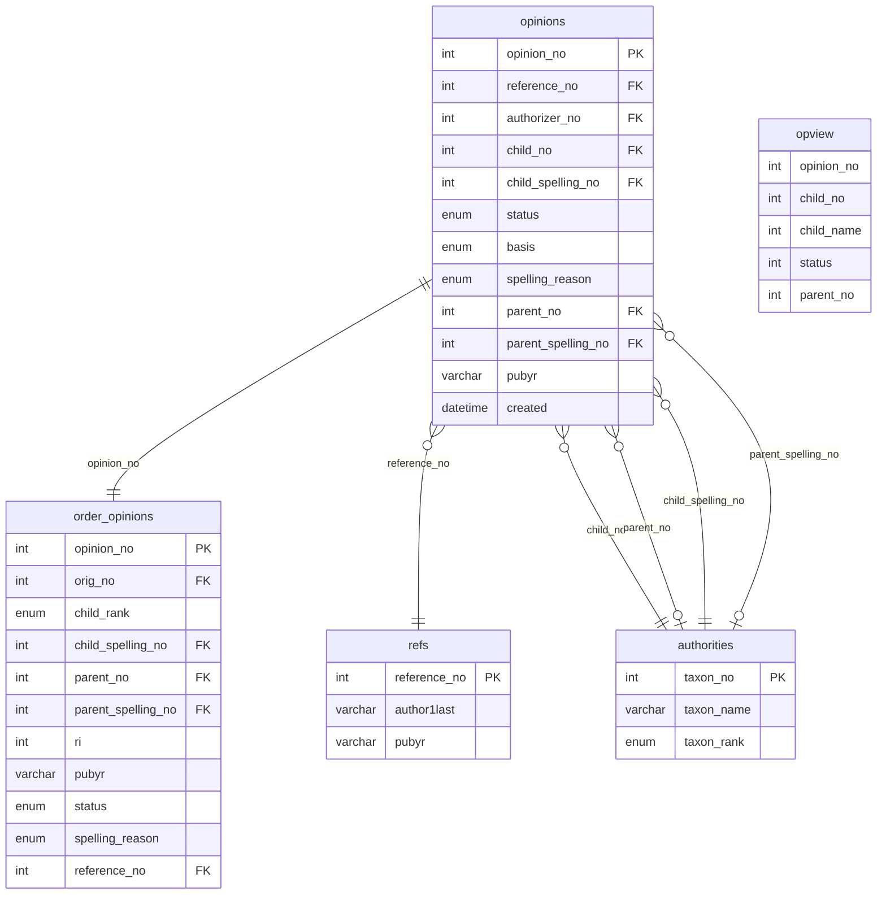
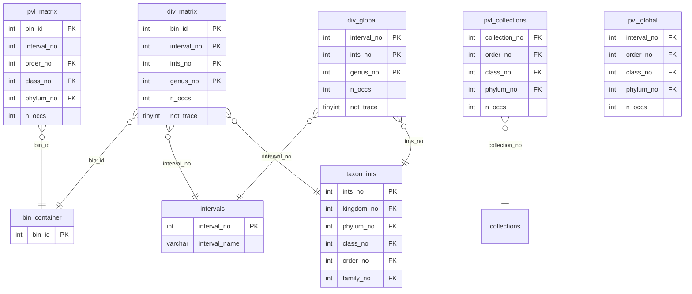
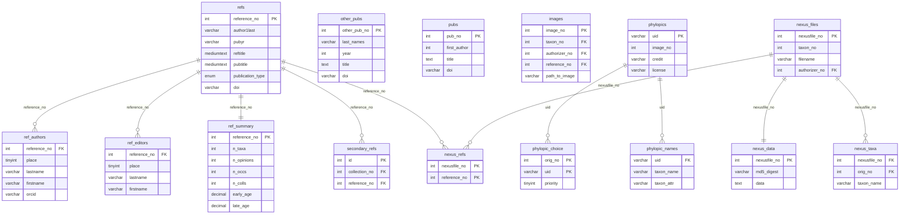
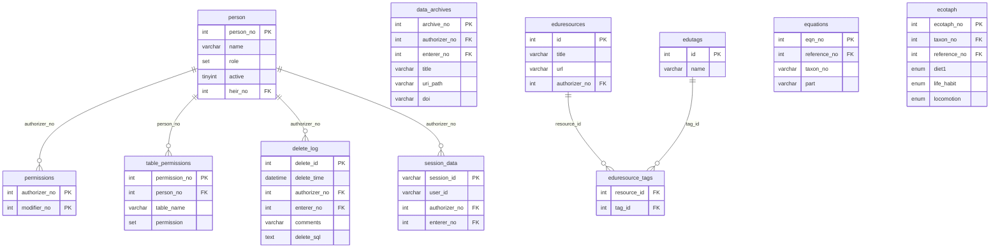

# PBDB Archive Database — ER Diagrams

All diagrams use Mermaid syntax. Paste into any Mermaid renderer (GitHub markdown, mermaid.live, VS Code preview) to visualize.

Legend:
- `PK` = Primary Key
- `FK` = Foreign Key (discovered, not enforced)
- `||--o{` = one-to-many
- `||--||` = one-to-one
- `}o--o{` = many-to-many

---

## 1. Core Entities

The central hub connecting taxonomy, collections, occurrences, references, and people.

---

## 2. Taxonomy

The taxonomic hierarchy: names, trees, opinions, and derived data.

---

## 3. Collections & Geography

Collection locations, stratigraphy, lithology, spatial bins, and paleocoordinates.

---

## 4. Occurrences & Specimens

Occurrence records, reidentifications, specimens, and measurements.

---

## 5. Time Intervals

Geological timescale definitions, hierarchies, and mappings.

---

## 6. Opinions & Classification

Taxonomic opinion records and their ordering.

---

## 7. Diversity & PVL Matrices

Pre-computed diversity and prevalence analysis tables.

---

## 8. Bibliographic & Media

References, authors, images, phylopics, and nexus file data.

---

## 9. Misc / Admin

Administrative tables, permissions, sessions, logging, and educational resources.

---

*Generated from pbdb_archive schema on 2026-02-10*
